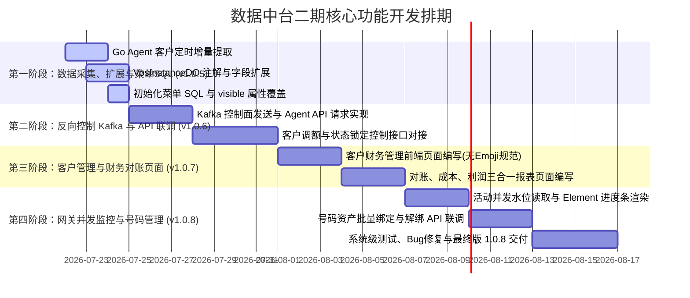

# VOS3000 数据中台功能设计、开发指导手册与项目排期计划

本文件作为 YK-VOS 数据中台二期核心功能开发的技术指引、功能设计与项目管理基准。所有前后端开发人员在编码和页面设计过程中必须严格遵守本规范。

---

## 一、 架构设计核心原则与开发注意事项

为确保 VOS3000 服务器的运行安全与稳定性，避免高频呼叫期间受外部管理查询的干扰，本项目中台架构遵循以下核心原则：

### 1. 查询 100% 隔离（读链路走本地库）
* 所有前端页面的数据呈现（包括**历史话单检索、利润对账报表、客户账户列表、网关并发水位监控**等），必须全部读取中台本地的 ClickHouse 或 MySQL 镜像库。
* **严禁在中台直接发起批量查询请求至 VOS 官方的 WebExternal 接口**，以避开官方接口调用频次与天数跨度限制，降低 VOS 节点的运行负荷。

### 2. 新增/修改 100% 走官方 API（写链路走 API 控制）
* 为保证 VOS 运行期内存缓存与通话路由引擎的数据一致性，任何涉及到**新增、删除、修改配置**的操作（如号码解绑/回收、号码导入、网关限额扩容、账户冻结），**严禁直接 SQL 物理更新 VOS 生产库的配置表**。
* 中台将修改操作打包成指令发送至 Kafka，由 VOS 节点上的 Go Agent 消费后，在本地请求 VOS 的 WebExternal API 接口（如 `/DeletePhone`），由 VOS 本地处理内存热重载与本地 MySQL 持久化。

### 3. 前端 UI 规范（禁用 Emoji 表情）
* **禁止在前端（Vue3 / Element Plus）页面中使用任何 Emoji 图标**（如 `🔴`, `🟢`, `📋`, `📊`, `⚙️` 等）作为标题、按钮、文本修饰或状态标示。
* **统一图标库**：所有图标及状态标识一律采用项目内置的 **Iconify/Lucide 图标库**进行渲染（如 `<IconifyIcon icon="lucide:clipboard-list" />`），以保持企业后台的专业严谨性。

---

## 二、 数据库直读与 VOS API 结合运作原理 (CQRS 闭环流程)

中台通过双通道闭环实现读写分离：

```
[前端页面] (查看数据) ──► 1. 读中台数据库 ──► 展现已绑定的 100 万个号码 (毫秒级，无压力)
   │
[执行回收/删除]
   │
   ▼
2. 发送 RECYCLE_PHONE 指令 (通过 Kafka)
   │
   ▼
3. Go Agent ──► 4. 调用本地 WebExternal API (/DeletePhone)
                       │
                       ▼
                 5. VOS 内存路由表实时生效 (无延迟)
                       │ (VOS 核心自动写盘)
                       ▼
                 6. VOS 本地 MySQL (删除 e_phone 记录)
                       │
                       ▼
                 7. 增量/定时同步上报 ──► 8. 刷回中台数据库 (数据一致性闭环)
```

---

## 三、 各功能模块详细设计 (Functional Specifications)

### 模块一：多节点客户财务管理与控制中心

#### 1. 界面与交互设计
* **顶部过滤区**：VOS 节点下拉框、账号/名称输入框、状态筛选（全部/正常/已冻结）、余额预警开关。
* **中部 KPI 指标组**：
  * 客户总数（内置 `lucide:users` 图标）。
  * 透支预警数（可用余额 <= 信用额度 + 100 元，显示红色警报文字）。
  * 已冻结账户数（显示红色 Badge）。
* **表格列定义**：`VOS节点` | `账户账号` | `客户名称` | `当前可用余额 (元)` | `今日已扣消费 (元)` | `信用限额 (元)` | `状态` | `最近更新时间` | `操作`
* **右侧/弹窗操作**：
  * **调整限额**：点击弹出 Dialog，输入新的限额数值（支持正负数）。
  * **冻结/解冻**：点击弹出二次确认 Dialog，下发冻结 status 状态指令。

#### 2. 后端 API 接口定义
* **客户列表分页查询**：`GET /admin-api/vos/customer/page`
* **控制指令下发**：`POST /admin-api/vos/customer/control`
  * 请求体：
    ```json
    {
      "vosId": "vos1",
      "customerId": 101,
      "action": "UPDATE_LIMIT",  // UPDATE_LIMIT / SET_STATUS
      "limitValue": -1000.00,    // 仅在 action = UPDATE_LIMIT 时有效
      "statusValue": 1           // 仅在 action = SET_STATUS 时有效 (0: 正常, 1: 冻结)
    }
    ```

---

### 模块二：话单对账与利润多维统计分析

#### 1. 界面与交互设计
* **顶部过滤区**：精确到秒的开始/结束时间选择器 (DateTime Range)、VOS节点过滤。
* **顶部 KPI 统计**：总收入 (`fee` 汇总)、总成本 (`agentfee` 汇总)、净利润 (`fee - agentfee`)、毛利率。
* **中部 Tab 切换页**：
  * **客户对账报表**：按 `customeraccount` 聚合。列定义：`客户账号` | `通话总次数` | `计费时长 (分钟)` | `应收费用 (收入)` | `落地成本` | `净利润`
  * **渠道成本报表**：按 `agentaccount` 聚合。列定义：`供应商账号` | `通话总次数` | `落地计费时长` | `应付费用 (成本)` | `接入费用` | `净利润`
  * **网关路由分析**：按对接网关、落地网关组合聚合。列定义：`对接网关` | `落地网关` | `通话总次数` | `总接通率` | `平均通话时长 (秒)` | `净利润贡献`

#### 2. 后端 API 接口定义
* **毛利统计 KPI 查询**：`GET /admin-api/vos/report/margin-kpi`
* **分组报表数据查询**：`GET /admin-api/vos/report/group-margin`
  * 参数：`beginTime`, `endTime`, `vosId`, `groupBy` ("customer" / "agent" / "gateway")

---

### 模块三：网关通路与并发水域预警监控

#### 1. 界面与交互设计
* **顶部概览卡片**：当前全局并发数（全节点活动呼叫数）、超载警告网关数。
* **监控表格**：`VOS节点` | `网关名称` | `类型` (对接/落地) | `并发上限` | `当前并发数` | `并发装载率 (Element 进度条)` | `接通率 (ASR)` | `平均时长 (ALOC)` | `PDD延时 (ms)`
  * **水位进度条颜色规则**：使用 `<IconifyIcon>` 进行状态标示。装载率 `< 70%` 显示绿色；`70% - 90%` 显示黄色；`>= 90%` 时显示红色警示并高亮闪烁。
* **操作列**：“网关扩容”按钮，点击弹窗可输入新并发数。

#### 2. 后端 API 接口定义
* **网关状态装载率列表**：`GET /admin-api/vos/gateway/load-status`
* **网关并发扩容控制**：`POST /admin-api/vos/gateway/control` (调用 VOS API `UpdateGateway` 指令)

---

### 模块四：号码资产管理 (VOS API 代理)

#### 1. 界面与交互设计
* **监控表格**：`VOS节点` | `电话号码 (E.164)` | `绑定客户账户` | `最大并发数` | `创建时间` | `操作`
* **操作列**：“导入号码”按钮（支持批量文本框导入并调用 WebExternal 的 `AddPhone` 接口）、“回收删除”按钮（调用 WebExternal 的 `DeletePhone` 接口）。

#### 2. 后端 API 接口定义
* **号码回收/删除**：`POST /admin-api/vos/phone/recycle`
  * 请求体：`{"vosId": "vos1", "e164s": ["800801", "800802"]}`
  * Go Agent 代理执行：本地向端口 9090 发送 `/external/server/DeletePhone` 接口，回执 `retCode == 0` 表示成功。

---

## 四、 前后端开发目录指引

* **前端视图代码**：`frontend/apps/web-ele/src/views/vos/`
  * 客户管理：`vos/customer/index.vue`
  * 网关监控：`vos/gateway/index.vue`
  * 号码管理：`vos/phone/index.vue`
  * 话单对账：`vos/report/index.vue`
* **前端 API 请求层**：`frontend/apps/web-ele/src/api/vos.ts`
* **后端控制器 (Controller)**：`cn.iocoder.yudao.module.vos.controller.admin.vos`
* **后端服务 (Service)**：`cn.iocoder.yudao.module.vos.service`
* **控制指令传输层 (Kafka)**：
  * 后端发布端：`AgentControlProducer.java`
  * Agent 接收端：`agent/internal/consumer/control_consumer.go`

---

## 五、 项目版本发布管理与开发排期进度

### 1. 严格版本升级管理规范
在编译打包生成部署包时，**严禁使用重复的版本号**。每次打包必须递增 Patch（修订号），确保环境升级自愈。
* **当前基线**：`1.0.4`
* 里程碑一发布包：`ykvos-server-dev-1.0.5.tar.gz`
* 里程碑二发布包：`ykvos-server-dev-1.0.6.tar.gz`
* 里程碑三发布包：`ykvos-server-dev-1.0.7.tar.gz`
* 里程碑四发布包：`ykvos-server-dev-1.0.8.tar.gz`

### 2. 里程碑与详细开发排期进度


